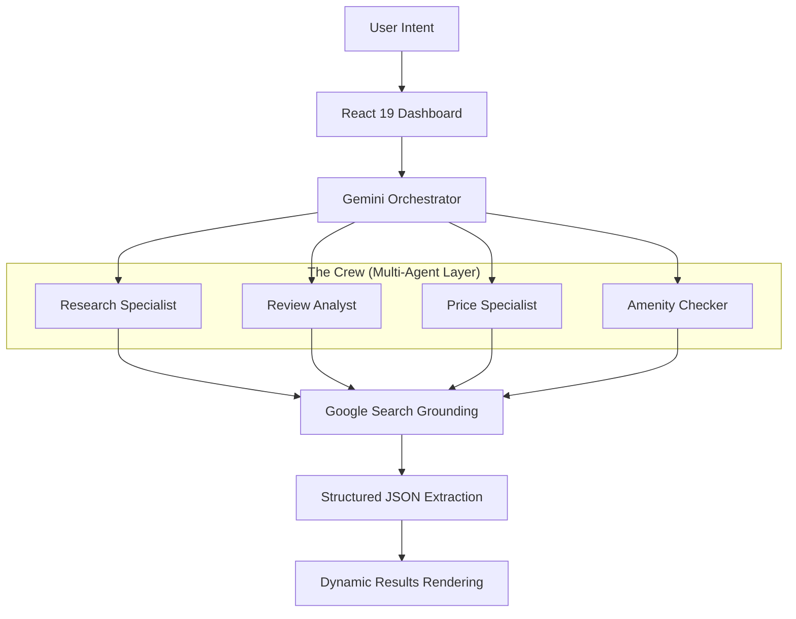

# ⚙️ TravelCrew AI: Autonomous Travel Engineering

<div align="center">
  

  [](https://reactjs.org/)
  [](https://www.typescriptlang.org/)
  [](https://vitejs.dev/)
  [](https://tailwindcss.com/)
  [](https://www.framer.com/motion/)
  [](https://ai.google.dev/)
</div>

---

## 🚀 The Blueprint
**TravelCrew AI** is a high-performance, multi-agent autonomous system designed to disrupt the fragmented travel booking experience. Instead of manual searching across dozens of tabs, TravelCrew deploys a specialized "Crew" of AI agents to research, verify, and compare the best stays in real-time using **Google Search Grounding**.

### ⚠️ The Problem
Traditional booking involves:
- **Fragmented Data:** Prices vary wildly across platforms.
- **Review Fatigue:** Analyzing thousands of contradictory reviews is exhausting.
- **Stale Information:** Static databases don't account for real-time changes or hidden fees.

### ✅ The Solution: Agentic Orchestration
TravelCrew AI solves this by engineering a parallelized research mission:
- **Real-time Grounding:** Leverages live Google Search data for up-to-the-minute pricing and availability.
- **Sentiment Synthesis:** Deep-dives into reviews to identify genuine pros and cons.
- **Unified Interface:** A futuristic, glassmorphic dashboard for mission control.

---

## 🧠 Intelligence & Architecture

The system operates on an **Agentic Workflow** where multiple specialized models collaborate to fulfill a single user intent.

### System Flow Architecture


### Core Technologies
| Layer | Technology | Purpose |
| :--- | :--- | :--- |
| **Frontend** | React 19 + TypeScript | Type-safe, high-performance UI components. |
| **AI Engine** | Gemini 1.5 Pro | Complex reasoning and multi-agent orchestration. |
| **Grounding** | Google Search | Real-time market data verification. |
| **Animation** | Framer Motion | Fluid transitions and "agentic" status feedback. |
| **Styling** | Tailwind CSS | Custom dark-mode glassmorphism system. |

---

## ✨ Primary Features

### 1. Autonomous Search Mission
Deploy a crew that performs deep research. Watch the real-time status panel as agents move from `pending` to `working` to `completed`.

### 2. AI-Powered Sentiment Analysis
Every hotel card includes a dedicated **AI Analysis** section, highlighting verified "Positives" and critical "Concerns" synthesized from thousands of data points.

### 3. Real-Time Price Comparison
The **Price Specialist** agent compares rates across MMT, Booking.com, and Agoda, identifying the "Best Match" for your budget.

### 4. Interactive Crew Chat
Need to tweak the mission? Chat directly with the **Lead Coordinator** to refine results or ask technical questions about specific properties.

---

## 🛠 Setup & Installation

Follow these steps to deploy your own instance of the TravelCrew AI system.

### Prerequisites
- Node.js 18+
- A Google Gemini API Key ([Get one here](https://aistudio.google.com/app/apikey))

### 1. Clone the Repository
```bash
git clone https://github.com/rahulcvwebsitehosting/travelcrew-ai.git
cd travelcrew-ai
```

### 2. Install Dependencies
```bash
npm install
```

### 3. Environment Configuration
Create a `.env` file in the root directory:
```env
VITE_GEMINI_API_KEY=your_api_key_here
```

### 4. Launch Development Server
```bash
npm run dev
```

---

## 🗺 UI Layout Blueprint

| Section | Description | Visual Mood |
| :--- | :--- | :--- |
| **Landing** | Hero section with "Engineering Your Perfect Stay" typography. | Dark, Minimal, High-Contrast |
| **Mission Control** | Real-time agent status panel with progress indicators. | Tech-Forward, Kinetic |
| **Results Grid** | Glassmorphic cards featuring AI-driven insights and price tags. | Premium, Informative |
| **Floating Chat** | Persistent AI coordinator for real-time mission refinement. | Accessible, Non-Intrusive |

---

## 🤝 Connect & Collaborate

Developed with passion by **Rahul Shyam**. I'm always open to discussing AI orchestration, frontend engineering, and the future of autonomous systems.

<div align="left">
  <a href="https://linkedin.com/in/rahulshyamcivil">
    
  </a>
  <a href="https://github.com/rahulcvwebsitehosting">
    
  </a>
</div>

---

<div align="center">
  <p><i>"Engineering the future of travel, one agent at a time."</i></p>
  <p>© 2026 TravelCrew AI. Built for the next generation of explorers.</p>
</div>
